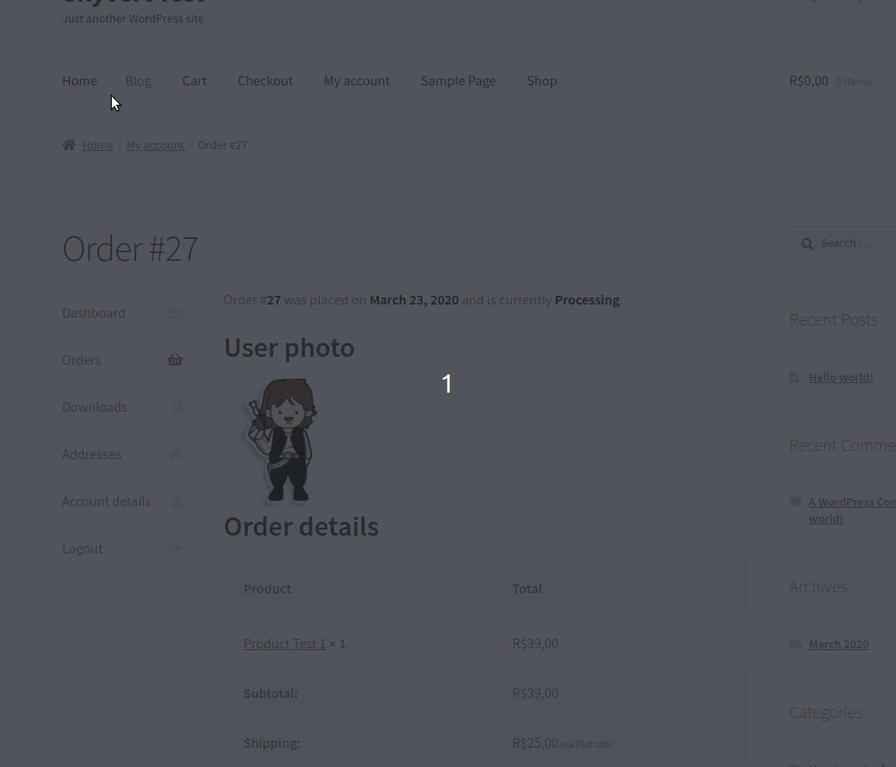
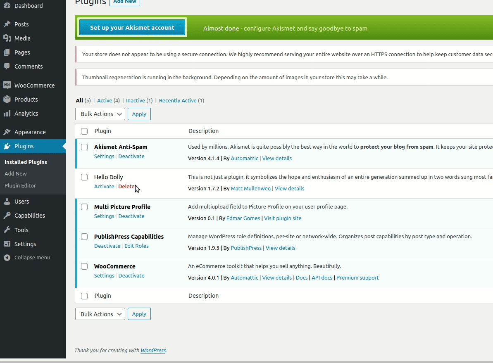

# Multi picture profile

## Add many photos in the profile

## Save current profile photo in the order

## Settings

This plugin allows the user to insert more than one profile photo

## Installation

1. Upload `multi-picture-profile` folder to the `/wp-content/plugins/` directory
2. Activate the plugin through the 'Plugins' menu in WordPress

View the code on <a href="https://github.com/edmargomes/multi-picture-profile-wp">GitHub</a>.

